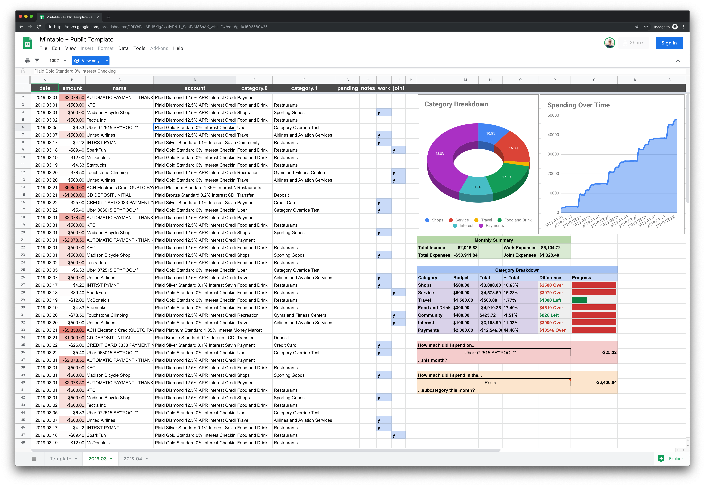

<h4 align="center"></h4>
<h1 align="center" style="font-weight: 500; font-size: 60px !important; border-bottom: 0 !important;">Mintable</h1>

<h4 align="center">Automate your personal finances – for free, with no ads, and no data collection.</h4>

<br>

Mintable helps you:

- Keep track of your account balances
- Aggregate transactions from all your banking institutions, including checking accounts, savings accounts, and credit cards
- Analyze and budget your spending using a spreadsheet and formulas



<br>

[](https://github.com/kevinschaich/mintable/actions?query=workflow%3ATest)
[](https://www.npmjs.com/package/mintable)
[](https://github.com/kevinschaich/mintable/releases)
[](https://github.com/kevinschaich/mintable/blob/master/LICENSE)
[](https://github.com/kevinschaich/mintable/issues)
[](https://github.com/kevinschaich/mintable/pulls)
[](https://reddit.com/r/Mintable)

---

## Quickstart

1. Sign up for [Plaid's Free Plan](https://plaid.com/pricing/).
2. Install Mintable:

    ```bash
    npm install -g mintable
    mintable setup
    ```

3. Update your account balances/transactions:

    ```
    mintable fetch
    ```

> **Note:** If you're already a version `1.x.x` user, you can [migrate your existing configuration to version `2.x.x`](./docs/README.md#migrating-from-v1xx).

## Documentation

Check out the full documentation [in the `./docs` folder](./docs/README.md).

## FAQs

**WTF is 'Mintable'?!**

> **min·ta·ble**: _noun._
> 1. An open-source tool to automate your personal finances – for free, with no ads, and no data collection. Derived from *mint* (the [wildly popular personal finance app from Intuit](https://www.mint.com/)) + *table* (a spreadsheet).

**Do I have to use Plaid?**

Nope. You can [import transactions from a CSV bank statement](./docs/README.md#manually--on-your-local-machine--via-csv-bank-statements) exclusively on your local machine. We also have [templates](./docs/templates) to get you started.

**Do I have to use Google Sheets?**

Nope. You can [export your account balances & transactions to a CSV file](./docs/README.md#on-your-local-machine--via-csv-files) exclusively on your local machine.

**Do I have to manually run this every time I want new transactions in my spreadsheet?**

Nope. You can automate it for free using [BitBar](./docs/README.md#automatically-in-your-macs-menu-bar--via-bitbar), [`cron`](./docs/README.md#automatically-in-your-local-machines-terminal--via-cron), or [GitHub Actions](./docs/README.md#automatically-in-the-cloud--via-github-actions).

**It's not working!**

- [File an issue](https://github.com/kevinschaich/mintable/issues) or  [](https://reddit.com/r/Mintable).

## Alternatives

- [**Money in Excel**](https://www.microsoft.com/en-us/microsoft-365/blog/2020/06/15/introducing-money-excel-easier-manage-finances/): Recently announced partnership between Microsoft/Plaid. Requires a Microsoft 365 subscription ($70+/year).
- [**Mint**](https://www.mint.com/): Owned by Intuit (TurboTax). Apps for iOS/Android/Web.
- [**build-your-own-mint**](https://github.com/yyx990803/build-your-own-mint): Some assembly required. More flexible.
