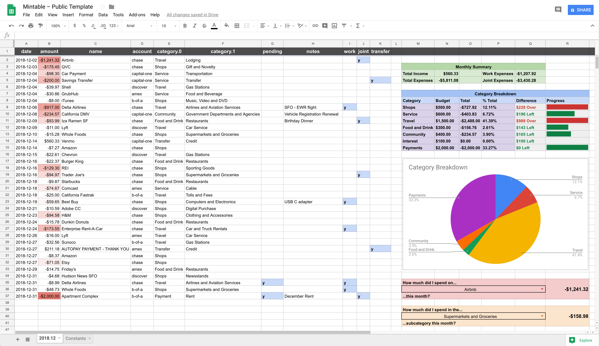

<h3 align="center">
Roll-your-own Mint clone for managing personal finances using the Google Sheets and Plaid APIs.
 </h3>

### Overview

Mintable allows you to automatically populate transactional data from your financial institutions into a Google Sheet for analysis and visualization. Here's how it works:

1. You select/create a "template" Google Sheet containing all the formulas and calculations you want to view on top of your transactions.
1. You use Mintable (which uses the Plaid and Google Sheets APIs) to connect your financial institutions to that sheet and populate transactions as they update.
1. Each month, Mintable will use the current month's sheet as the "base" for the next month, keeping all the formatting and calculations on top of your data intact.

## Setup

#### Housekeeping

1. Rename `.env.sample` to `.env`. Variables in this file will be loaded as environment variables. This file is ignored by Git.
1. Run `npm install` in the repo root.

#### Plaid

1. You will first need to sign up for [Plaid](https://plaid.com/) and apply for the development plan. You might need to wait for a day or two to get approved. It's free and limited to 100 items (i.e. banks), so it should be more than enough for your personal use.
1. Once approved, fill out the following in `.env`:
    1. `PLAID_CLIENT_ID`
    1. `PLAID_SECRET`
    1. `PLAID_PUBLIC_KEY`
1. Run `npm run token-plaid <account>` where `account` is an id for the bank you want to connect (it's for your personal reference, so you can name it anything).
1. You should now have a local server running to connect your financial institutions – open [https://localhost:8080](https://localhost:8080) to go through the authentication flow. Once you've linked the bank, its associated access token will be saved in `.env`. This process needs to be repeated for each bank you want to connect. Make sure to run each with a different `account` name.
1.  If you've done everything correctly, running `npm run test-plaid` now should log the recent transactions in your connected accounts.

#### Google Sheets

1. Create a Google Sheets spreadsheet, and save its ID in `.env` as `SHEETS_SHEET_ID`. You can find this in the spreadsheet URL as `https://docs.google.com/spreadsheets/d/<ID>/edit`.
1. Go to [Google Sheets API Quickstart](https://developers.google.com/sheets/api/quickstart/nodejs), and click **Enable the Google Sheets API**. Follow instructions and download the credentials JSON file. Take a look at the file and fill in the following fields in `.env`:
    1. `SHEETS_CLIENT_ID`
    1. `SHEETS_CLIENT_SECRET`
    1. `SHEETS_REDIRECT_URI` (use the first item in `redirect_uri`)
1. Run `npm run token-sheets`. This will prompt for auth and save the token in `.env`.
1. If you've done everything correctly, running `npm run test-sheets` should fill cell A1 in your sheet with "It worked!".

#### Usage

1. After completing the above steps, run `node index.js` in the repo root. If everything works, your spreadsheet should have been updated.

> **Note:** The logic for transforming raw Plaid transactions to Google Sheets cell data is defined in `index.js` – helpers can be found in the `lib` folder.

#### Updating your Template Sheet

Out of the box, Mintable will populate a very basic list of transactions. Since the Google Sheets APIs are cumbersome to interact with for manipulating cell data and formatting, I recommend that you create a "template" sheet as a base. Mintable will only touch the few spreadsheet columns it needs to update transactional data (defined in `index.js`), so the right side of your spreadsheet be as complex as you like and contain all the calculations, formulas, and visualizations you want to see for each month's data. You can create your own template or start with this premade one with some useful formulas:

* [Mintable – Public Template on Google Sheets](https://docs.google.com/spreadsheets/d/10fYhPJzABd8KlgAzxtiyFN-L_SebTvM8SaAK_wHk-Fw/edit#gid=1649215680)

To use this as your monthly template sheet:

1. Delete all the automated sheets in your Mintable spreadsheet.
1. Click the downwards arrow on the `2018.12` sheet in the template, then **Copy To...**, and select your Mintable spreadsheet when Google asks where you want to copy to.
1. Do the same for the `Constants` sheet.
1. In your Mintable spreadsheet, change the name of the `Copy of 2018.12` sheet to `<YEAR>.<LAST MONTH>`. For example, if the current date is February 1, 2019, change the name of the first sheet to `2019.01`.
1. Rename the `Copy of Constants` sheet to `Constants`.
1. Re-run `node index.js` from the repo root. If everything works, your spreadsheet should have been updated with calculations intact! You may need to fix any broken formula references that got messed up in the copy process.

#### Automated Updates

This repo includes config files for both [CircleCI](https://circleci.com/) and [Travis CI](https://travis-ci.com) to run daily builds automatically.

Note that your local `.env` is not checked into the repo, so you will need to copy all those env variables into your project settings to use this feature. This is totally optional if you don't trust CI with your tokens. Just run it manually when you want to update things.

## Credits & Alternatives

Mintable started out as a fork of [Evan You](https://github.com/yyx990803)'s [build-your-own-mint](https://github.com/yyx990803/build-your-own-mint) skeleton, and after a few contributions it was clear that my fork had become incompatible. I didn't want to fix something that wasn't broken; so became the start of [Mintable](#).

* [build-your-own-mint](https://github.com/yyx990803/build-your-own-mint) is an awesome set of scripts that makes the integration between Plaid and Google Sheets painless. It makes no assumptions about what you want your spreadsheet to look like or how updates should be handled each month, and allows you to define your own logic in [`transform.js`](https://github.com/yyx990803/build-your-own-mint/blob/master/lib/transform.js) to map transactional data to cell updates.
* [Mintable](#) enforces a specific spreadsheet layout (transactions flow in on the left and overwrite certain columns, while you are free to do analysis on the right). It creates a new sheet for every month and uses the previous month's sheet as a template, giving you a working end-to-end analytics toolkit out of the box if you use the [Template Sheet](#updating-your-template-sheet) above. [Mintable](#) relies on some of the same scripts used in [build-your-own-mint](https://github.com/yyx990803/build-your-own-mint) and you can examine the additional logic yourself in [`index.js`](https://github.com/kevinschaich/mintable/blob/master/index.js) and [`lib/sheets.js`](https://github.com/kevinschaich/mintable/blob/master/lib/sheets.js) to determine if it fits your needs. The end goal would be to accept contributions for a *variety* of other Template Sheets above which follow the same format – making them completely plug-and-play.
* [Firefly III](https://github.com/firefly-iii/firefly-iii) is a self-hosted personal finance app which is also popular in the GitHub community. If you don't feel comfortable giving your data to Plaid and Google, you can give [Firefly III](https://github.com/firefly-iii/firefly-iii) a try.

## FAQs

**How is this different from [build-your-own-mint](https://github.com/yyx990803/build-your-own-mint)?**

See [Credits and Alternatives](#credits-and-alternatives) above for a detailed comparison.

**Do I have to give my data to Plaid and Google? Are there any completely self-hosted alternatives I can use?**

As of the time of writing, Mintable relies on Plaid for integrating with your banks and fetching transactional data, and uses Google Sheets as the storage/visualization layer.

That being said, I'd be happy to approve contributions for a pluggable interface for both the transactional and spreadsheet pieces.
