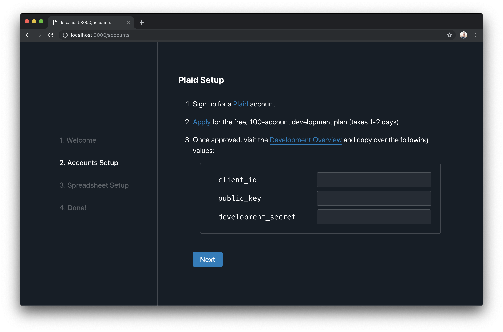

<h4 align="center"><h4 align="center">Roll your own ad-free Mint clone for managing personal finances using publicly available APIs.</h4><br></h4>


## Quickstart

```bash
git clone https://github.com/kevinschaich/mintable.git
cd mintable
yarn
yarn setup
```

`yarn setup` will launch a web server & open a page in your web browser to walk you through the set-up. After you have your accounts connected, run:

```
yarn mintable
```

to populate your spreadsheet!

> **Note**: If you started using Mintable before `v1.0.0`, run `yarn migrate` to migrate to the new web-based configuration framework.

## Overview


Mintable simplifies managing your finances, for free, without ads, and without tracking your information. Here's how it works:

1. You connect your accounts and a spreadsheet to Mintable.
1. Mintable integrates with financial institutions to automatically populate transactions in your spreadsheet.
1. You can add whatever formulas, charts, or calculations you want (just like a normal spreadsheet). We also have templates to get you started.

## Features

- Locally hosted, open-source, 100% free, ad-free, no personal data tracking, no data stored by Mintable on central servers
- Integrates with your financial institutions for fully-automated spreadsheet updates
- Web based setup wizard and configuration framework:



You can see a full list of options in the **[Config Docs](./docs/CONFIG.md)**.

## FAQs

**How is this different from [build-your-own-mint](https://github.com/yyx990803/build-your-own-mint)?**

- **[build-your-own-mint](https://github.com/yyx990803/build-your-own-mint)** is a set of scripts which solely facilitates the integration between Plaid and Google Sheets. It makes no assumptions about what you want your spreadsheet to look like, and you have to define your own logic to map transactions to spreadsheet updates.
- **[Mintable](#)** is and end-to-end system that works out of the box. It comes with a setup wizard, a web-based configuration server, pluggable providers (you're not limited to just Plaid & Google Sheets), and a spreadsheet template.

**Do I have to give my data to Plaid and Google? Are there any completely self-hosted alternatives I can use?**

It's pluggable! Plaid & Sheets are working right now – contributions are welcome for other providers!

**Do I have to manually run this every time I want new transactions in my spreadsheet?**

You can **[Automate Updates with a CI Provider](./docs/CONFIG.md#automate-updates-with-a-ci-provider)** to get free, automated updates!

## Credits

Mintable initially started as a fork of [Evan You](https://github.com/yyx990803)'s [build-your-own-mint](https://github.com/yyx990803/build-your-own-mint).
