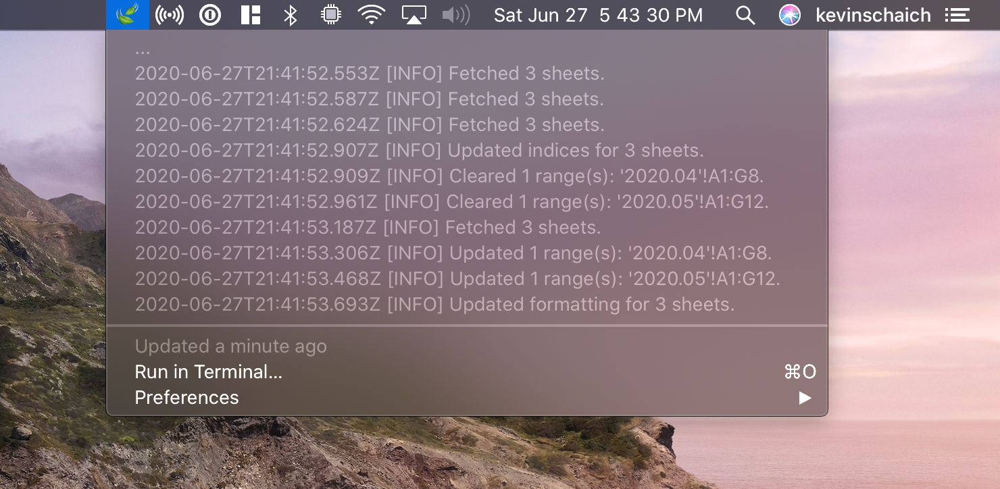

# Documentation

#### Table of Contents

- [Overview](#overview)
- [Installation](#installation)
  - [Creating a Fresh Installation](#creating-a-fresh-installation)
  - [Migrating from `v1.x.x`](#migrating-from-v1xx)
- [Adding/Updating Accounts](#addingupdating-accounts)
  - [Automatically – in the cloud – via Plaid](#automatically-in-the-cloud--via-plaid)
  - [Manually – on your local machine – via CSV bank statements](#manually--on-your-local-machine--via-csv-bank-statements)
- [Updating Transactions/Accounts](#updating-transactionsaccounts)
  - [Manually – in your local machine's terminal](#manually-in-your-local-machines-terminal)
  - [Automatically – in your Mac's Menu Bar – via BitBar](#automatically-in-your-macs-menu-bar--via-bitbar)
  - [Automatically – in the cloud – via GitHub Actions](#automatically-in-the-cloud--via-github-actions)
- [Development](#development)

## Overview


Mintable simplifies managing your finances, for free, without ads, and without tracking your information. Here's how it works:

1. You connect your accounts and a spreadsheet to Mintable.
1. Mintable integrates with financial institutions to automatically populate transactions in your spreadsheet.
1. You can add whatever formulas, charts, or calculations you want (just like a normal spreadsheet). We also have templates to get you started.

## Installation

### Creating a Fresh Installation

1. Sign up for [Plaid's Free Plan](https://plaid.com/pricing/). The free plan is limited to 100 banking institutions which should be more than enough for personal use. After applying and verifying your email it usually takes a day or two for them to approve your account.
2. Install the global `mintable` command line utility:

    ```bash
    npm install -g mintable
    ```

3. Set up the integration with your banks and a spreadsheet using the setup wizard:

    ```bash
    mintable setup
    ```

4. Update your account balances/transactions:

    ```
    mintable fetch
    ```


### Migrating from `v1.x.x`

1. Install the new `v2.x.x` `mintable` command line utility:

    ```bash
    npm install -g mintable
    ```

2. Migrate your config to the new format:

    ```bash
    mintable migrate --old-config-file /path/to/your/old/mintable.config.json
    ```

3. Update your account balances/transactions:

    ```bash
    mintable fetch
    ```

> **Note:** After successful migration you can delete everything in your `v1.x.x` `mintable` folder. You may want to keep a copy of your `mintable.config.json` for posterity.

## Adding/Updating Accounts

### Automatically – in the cloud – via [Plaid](https://plaid.com)

You can run:

```bash
mintable account-setup
```

to enter the account setup wizard. This will launch a local web server (necessary to authenticate with Plaid's servers) for you to connect your banks.

To add a new account, click the blue **Link A New Account** button. To re-authenticate with an existing account, click the blue **Update** button next to the account name in the table.

### Manually – on your local machine – via CSV bank statements

You can run:

```bash
mintable csv-import-setup
```

to enter the CSV import setup wizard. This will allow you to manually import files or globs (`path/to/my/folder/transactions/*.csv`) every time `mintable fetch` is run.

You'll need to define a transformer to map properties in your source CSV spreadsheet to valid Mintable transaction properties, and a valid date format.

We have a number of templates available for popular financial institutions if you want to take this route:

- [Apple Card](./templates/apple-card.json)
- [Discover Card](./templates/discover-card.json)
- [Venmo](./templates/venmo.json)
- [Chase](./templates/chase.json)

These templates can be added into the `accounts` section of your `mintable.jsonc` configuration file.

## Updating Transactions/Accounts

### Manually – in your local machine's terminal

After you have connected a banking institution, you can run:

```bash
mintable fetch
```

to automate updates to your spreadsheet.

### Automatically – in your Mac's Menu Bar – via [BitBar](https://github.com/matryer/bitbar#get-started)

You can put Mintable in your Mac's menu bar, and have it run automatically every hour using our [BitBar Plugin](https://github.com/matryer/bitbar-plugins/pull/1460)



### Automatically – in the cloud – via GitHub Actions

1. Fork [this repo](https://github.com/kevinschaich/mintable).
2. Go to your forked repo's **Settings** > **Secrets** and add a **New Secret**.
3. Name the secret `MINTABLE_CONFIG`, and copy and paste the full contents of your `~/mintable.jsonc` file into the body of the secret.
4. Go to your forked repo's **Actions** tab and the **Fetch** job will build your repo by default on every commit.

## Development

To get started:

```bash
git clone https://github.com/kevinschaich/mintable
cd mintable
npm install
npm run-script build
npm link
```

The global `mintable` command will now point to your local dev version. To publish a new version:

```bash
npm run build
npm publish
```

<!--

#### Category Overrides

`CATEGORY_OVERRIDES` specifies a list of overrides to handle transactions that are routinely miscategorized by Plaid's servers.

**Default:** 

```javascript
"CATEGORY_OVERRIDES": []
```

Overrides take the following format:

* `pattern`: [JavaScript Regular Expression](https://developer.mozilla.org/en-US/docs/Web/JavaScript/Reference/Global_Objects/RegExp#Syntax) to test transaction names against
* `flags`: [JavaScript Regular Expression flags](https://developer.mozilla.org/en-US/docs/Web/JavaScript/Reference/Global_Objects/RegExp#Syntax) (i.e. `i` for case insensitive)
* `category.0`: Override for first (top-level) category
* `category.1`: Override for second (level-2) category

For example, if you want anything matching `autopay` or `e-payment` to get categorized as `Credit Card Payment`, you could add the following lines to your `mintable.config.json` file:

```javascript
"CATEGORY_OVERRIDES": [
    {
        "pattern": ".*(autopay|e.payment).*",
        "flags": "i",
        "category.0": "Transfer",
        "category.1": "Credit Card Payments"
    }
]
```

## Google Sheets

#### Template Sheet

`TEMPLATE_SHEET` specifies the template spreadsheet to use when creating a _new_ sheet for a month.

**Default:** 

```javascript
"TEMPLATE_SHEET": {
     // Public template: https://docs.google.com/spreadsheets/d/10fYhPJzABd8KlgAzxtiyFN-L_SebTvM8SaAK_wHk-Fw
    "SHEET_ID": "10fYhPJzABd8KlgAzxtiyFN-L_SebTvM8SaAK_wHk-Fw",
    "SHEET_TITLE": "Template"
}
```

* `SHEET_ID`: Google Sheets spreadsheet ID (from the URL: `docs.google.com/spreadsheets/d/`**`sheet_id`**`/edit`)
* `SHEET_TITLE`: Title of the sheet (along the bottom row of the document)

For example, you could add the following lines to your `mintable.config.json` file:

```javascript
"TEMPLATE_SHEET": {
    "SHEET_ID": "10fYhPJzABd8KasbqiyFN-L_SebTvM8SaAK_wHk-Fw",
    "SHEET_TITLE": "My Template Sheet"
}
```

-->
