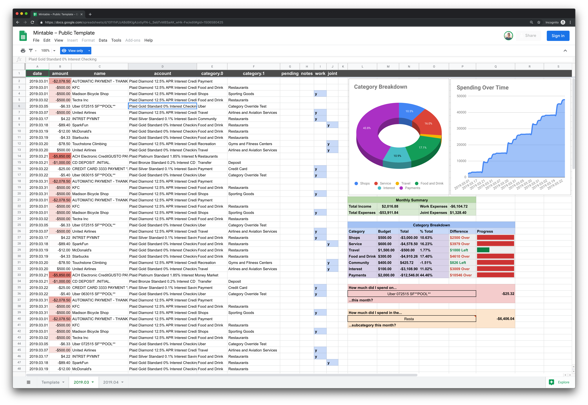

# Documentation

#### Table of Contents

- [Overview](#overview)
- [Installation](#installation)
  - [Creating a Fresh Installation](#creating-a-fresh-installation)
  - [Migrating from `v1.x.x`](#migrating-from-v1xx)
- [Importing Account Balances & Transactions](#importing-account-balances--transactions)
  - [Automatically – in the cloud – via Plaid](#automatically-in-the-cloud--via-plaid)
  - [Manually – on your local machine – via CSV bank statements](#manually--on-your-local-machine--via-csv-bank-statements)
- [Exporting Account Balances & Transactions](#exporting-account-balances--transactions)
  - [In the cloud – via Google Sheets](#in-the-cloud-via-google-sheets)
  - [On your local machine – via CSV files](#on-your-local-machine--via-csv-files)
- [Updating Transactions/Accounts](#updating-transactionsaccounts)
  - [Manually – in your local machine's terminal](#manually-in-your-local-machines-terminal)
  - [Automatically – in your Mac's Menu Bar – via BitBar](#automatically-in-your-macs-menu-bar--via-bitbar)
  - [Automatically – in your local machine's terminal – via `cron`](#automatically-in-your-local-machines-terminal--via-cron)
  - [Automatically – in the cloud – via GitHub Actions](#automatically-in-the-cloud--via-github-actions)
- [Transaction Rules](#transaction-rules)
  - [Transaction `filter` Rules](#transaction-filter-rules)
  - [Transaction `override` Rules](#transaction-override-rules)
- [Development](#development)
- [Contributing](#contributing)

## Overview



Mintable simplifies managing your finances, for free, without ads, and without tracking your information. Here's how it works:

1. You connect your accounts and a spreadsheet to Mintable.
1. Mintable integrates with your financial institutions to automatically populate transactions into the leftmost columns in your spreadsheet.
1. You can add whatever formulas, charts, or calculations you want to the right of your transactions (just like a normal spreadsheet). We also have templates to get you started.

---

## Installation

### Creating a Fresh Installation

1. Sign up for [Plaid's Free Plan](https://plaid.com/pricing/). The free plan is limited to 100 banking institutions which should be more than enough for personal use. After applying and verifying your email it usually takes a day or two for them to approve your account.
2. Install the global `mintable` command line utility:

    ```bash
    npm install -g mintable
    ```

3. Set up the integration with your banks and a spreadsheet using the setup wizard:

    ```bash
    mintable setup
    ```

4. Update your account balances/transactions:

    ```
    mintable fetch
    ```


### Migrating from `v1.x.x`

> **⚠️ Warning:** Plaid [introduced a breaking change in July 2020](https://github.com/plaid/plaid-node/pull/310) which deprecates the Public Key component from the authentication process. Once you upgrade to `v2.x.x` and disable your Public Key, you will no longer be able to continue using your `v1.x.x` installation. Proceed with caution.

1. [Disable the Public Key in your Plaid Dashboard](https://plaid.com/docs/upgrade-to-link-tokens/#disable-the-public-key) (read ⚠️ above!)

2. Install the new `v2.x.x` `mintable` command line utility:

    ```bash
    npm install -g mintable
    ```

3. Migrate your config to the new format:

    ```bash
    mintable migrate --old-config-file /path/to/your/old/mintable.config.json
    ```

4. Update your account balances/transactions:

    ```bash
    mintable fetch
    ```

> **Note:** After successful migration you can delete everything in your `v1.x.x` `mintable` folder. You may want to keep a copy of your `mintable.config.json` for posterity.

---

## Importing Account Balances & Transactions

### Automatically – in the cloud – via [Plaid](https://plaid.com)

You can run:

```bash
mintable plaid-setup
```

to enter the Plaid setup wizard. This will allow you to automatically fetch updated account balances/transactions from your banking institutions every time `mintable fetch` is run.

After you have the base Plaid integration working, you can run:

```bash
mintable account-setup
```

to enter the account setup wizard to add, update, or remove accounts.


This will launch a local web server (necessary to authenticate with Plaid's servers) for you to connect your banks.

To add a new account, click the blue **Link A New Account** button. To re-authenticate with an existing account, click the blue **Update** button next to the account name in the table.

> **Note:** Plaid is the default import integration and these steps are not necessary if you've already run `mintable setup`.

### Manually – on your local machine – via CSV bank statements

You can run:

```bash
mintable csv-import-setup
```

to enter the CSV import setup wizard. This will allow you to manually import files or globs (`path/to/my/folder/transactions/*.csv`) every time `mintable fetch` is run.

You'll need to define a transformer to map properties in your source CSV spreadsheet to valid Mintable transaction properties, and a valid date format.

We have a number of templates available for popular financial institutions to get you started:

- [Apple Card](./templates/apple-card.json)
- [Discover Card](./templates/discover-card.json)
- [Venmo](./templates/venmo.json)
- [Chase](./templates/chase.json)
- [American Express](./templates/american-express.json)
- [Rogers Bank Credit Card](./templates/rogers-bank-credit-card.json)

These templates can be added into the `accounts` section of your `mintable.jsonc` configuration file.

> **Note:** CSV Imports do not support account balances.

---

## Exporting Account Balances & Transactions

### In the cloud – via [Google Sheets](https://www.google.com/sheets/about/)

You can run:

```bash
mintable google-setup
```

to enter the Google Sheets setup wizard. This will allow you to automatically update a sheet with your transactions/account balances every time `mintable fetch` is run.

> **Note:** Google Sheets is the default export integration and this step is not necessary if you've already run `mintable setup`.

### On your local machine – via CSV files

You can run:

```bash
mintable csv-export-setup
```

to enter the CSV export setup wizard. This will allow you to manually export a CSV containing your transactions/account balances every time `mintable fetch` is run.

---

## Updating Transactions/Accounts

### Manually – in your local machine's terminal

After you have connected a banking institution, you can run:

```bash
mintable fetch
```

to automate updates to your spreadsheet.

### Automatically – in your Mac's Menu Bar – via [BitBar](https://github.com/matryer/bitbar#get-started)

You can put Mintable in your Mac's menu bar, and have it run automatically every hour using our [BitBar Plugin](https://github.com/matryer/bitbar-plugins/pull/1460).


1. [Install BitBar](https://github.com/matryer/bitbar/releases) on your Mac.
2. Set your plugin folder.
3. Create a new file in `mintable.1h.zsh` in your plugin folder.
4. Copy & paste [this](https://github.com/matryer/bitbar-plugins/blob/39e8f252ed69d0dd46bbe095299e52279e86d737/Finance/mintable.1h.zsh) into the file you just created and save.
5. Open **BitBar** > **Preferences** > **Refresh All** to update your spreadsheet.

> **Note:** The plugin above is pending approval and this install process should be much easier moving forward.

### Automatically – in your local machine's terminal – via `cron`

You can run Mintable automatically within your terminal using `cron`:


```bash
echo "0 * * * * export PATH="/usr/local/bin:$PATH" && mintable fetch" > ~/mintable.cron
crontab ~/mintable.cron
```

The first step creates a new file `~/mintable.cron` which contains an interval and the command you want to run. The second step registers that file with `crontab`, the command-line executable which actually schedules the job with your operating system.

The default refresh interval is 1 hour – you can use [Crontab Guru](https://crontab.guru/) to define your own interval.

You can remove this schedule by running:

```bash
crontab -r
```

> **Note:** The instructions above assume your global `mintable` CLI lives in `/usr/local/bin`, but if your installation path is different (run `which mintable`) you should use that instead.

### Automatically – in the cloud – via GitHub Actions

You can use GitHub Actions to run Mintable automatically in the cloud:


1. Fork [this repo](https://github.com/kevinschaich/mintable).
2. Go to your repo's **Actions** > Click **I understand my workflows, go ahead and enable them**
3. Go to your repo's **Settings** > **Secrets** and add a **New Secret**.
4. Name the secret `MINTABLE_CONFIG`, and copy and paste the full contents of your `~/mintable.jsonc` file into the body of the secret.
5. In your repo's `./.github/workflows/fetch.yml`, uncomment the following block and commit the changes:

    ```
        # schedule:
        #   - cron:  '0 * * * *'
    ```

In the **Actions** tab of your repo, the **Fetch** workflow will now update your sheet periodically. The default refresh interval is 1 hour – you can use [Crontab Guru](https://crontab.guru/) to define your own interval.

> **Note:** The minimum interval supported by GitHub Actions is every 5 minutes.

---

## Transaction Rules

### Transaction `filter` Rules

Transaction `filter` rules allow you to exclude transactions from your spreadsheet based on a set of [conditions](https://developer.mozilla.org/en-US/docs/Web/JavaScript/Guide/Regular_Expressions).

For example, if you wanted to exclude any cross-account transfers, you might add the following to your `transactions.rules` config:

```json
"rules": [
    {
        "conditions": [
            {
                "property": "name",
                "pattern": "(transfer|xfer|trnsfr)",
                "flags": "ig"
            }
        ],
        "type": "filter"
    }
]
```

### Transaction `override` Rules

Transaction `override` rules allow you to override auto-populated fields based on a set of [conditions](https://developer.mozilla.org/en-US/docs/Web/JavaScript/Guide/Regular_Expressions), search for a [pattern](https://developer.mozilla.org/en-US/docs/Web/JavaScript/Guide/Regular_Expressions), and replace it with another [pattern](https://developer.mozilla.org/en-US/docs/Web/JavaScript/Guide/Regular_Expressions).

You might want to do this to standardize values between financial institutions (`XFER` -> `Transfer`), or tune things to suit your particular budgeting needs (described below).

For example, let's say you want to know how much you are spending on coffee each month, but Plaid/your bank categorizes your favorite shops as `Restaurants – Fast Food`. You might add the following to your `transactions.rules` config:

```json
"rules": [
    {
        "conditions": [
            {
                "property": "name",
                "pattern": "(dunkin|starbucks|peets|philz)",
                "flags": "ig"
            }
        ],
        "type": "override",
        "property": "category",
        "findPattern": "Fast Food",
        "replacePattern": "Coffee Shops",
        "flags": "i"
    }
]
```

When you run `mintable fetch` the next time, the category would be `Restaurants – Coffee Shops`.

## Development

To get started:

```bash
git clone https://github.com/kevinschaich/mintable
cd mintable

npm install
npm run build
npm link
```

The global `mintable` command will now point to your local version (`/lib/scripts/cli.js`). To start compilation in watch mode:

```bash
npm run watch
```

To publish a new version, increment `version` in `package.json` and run:

```bash
npm run build
npm publish
```

To revert to the production release of `mintable`, run:

```bash
npm unlink
npm install -g mintable
```

## Contributing

Before posting please check if your issue has already been reported. We'll gladly accept PRs, feature requests, or bugs via [Issues](https://github.com/kevinschaich/mintable/issues).
